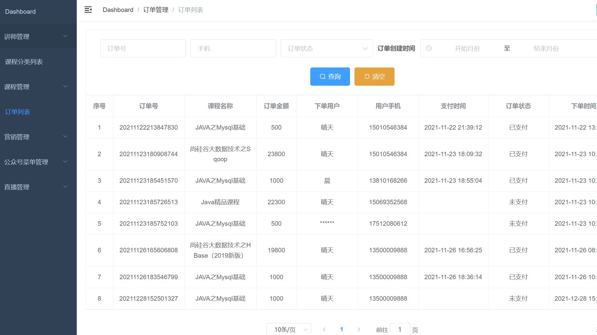

# TheClassRoom


- TheClassRoom是**基于尚硅谷硅谷课堂**的练习项目，分为**后台管理系统**和**前台用户系统**
- **前台用户系统**基于微信公众号开发，包括课程学习、微信公众号信息等功能
- **后台管理系统**为系统管理，包括讲师管理、课程分类管理、课程管理、订单管理、营销管理、微信公众号菜单管理、直播管理模块

**建议直接学习[谷粒在线教育项目]**

## 零、对硅谷课堂的部分更改

- 将项目模块结构、包结构做了部分更改
- 管理页面做了部分调整


## 一、技术架构

### 硅谷课程流程图


#### 硅谷课堂功能架构


### 硅谷课堂技术架构


### 后端技术

|        技术        |       说明       |                      官网                       |
| :----------------: | :--------------: | :---------------------------------------------: |
|     SpringBoot     |   容器+MVC框架   |     https://spring.io/projects/spring-boot      |
|    SpringCloud     |    微服务架构    |     https://spring.io/projects/spring-cloud     |
| SpringCloudAlibaba |    一系列组件    | https://spring.io/projects/spring-cloud-alibaba |
|    MyBatis-Plus    |     ORM框架      |             https://mp.baomidou.com             |
|        COS         | 腾讯云对象云存储 |  https://github.com/tencentyun/cos-java-sdk-v5  |
|     EasyExcel      |  处理Excel工具   |       https://www.yuque.com/easyexcel/doc       |

### 前端技术

|    技术    |      说明      |                   官网                   |
| :--------: | :------------: | :--------------------------------------: |
|    Vue     |    前端框架    |            https://vuejs.org             |
| Element-ui |   前端UI框架   |     https://element.eleme.cn/#/zh-CN     |
|    Nuxt    |   前端UI框架   |          https://zh.nuxtjs.org/          |
|  node.js   |   服务端的js   |          https://nodejs.org/en           |
|  Echarts   | 数据可视化图表 | https://echarts.apache.org/zh/index.html |

## 二、功能展示

### 讲师管理


### 课程分类管理


### 课程管理


### 订单列表



### 优惠券管理


### 公众号菜单管理


### 直播管理


## 三、环境搭建

### 开发工具

|     工具      |      说明      |                  官网                   |
| :-----------: | :------------: | :-------------------------------------: |
|     IDEA      |  开发Java程序  | https://www.jetbrains.com/idea/download |
|VS Code|前端代码开发|https://code.visualstudio.com/ |
|    Navicat    | 数据库连接工具 |   http://www.formysql.com/xiazai.html  |
| PowerDesigner | 数据库设计工具 |         http://powerdesigner.de |
|    Typora     |   Markdown编辑器    |  https://typora.io      |

### 开发环境

|  工具  |   版本号   |                             下载                             |
| :----: | :--------: | :----------------------------------------------------------: |
|  JDK   | 1.8.0_181  | https://www.oracle.com/java/technologies/javase/javase-jdk8-downloads.html |
| Mysql  |   8.0.23   |                    https://www.mysql.com                     |
| Redis  |   Redis    |                  https://redis.io/download                   |
| 花生壳 | anyVersion | https://hsk.oray.com/ |

### 搭建步骤

#### 1、准备工作

- 安装 IDEA，Visual Studio Code，JDK >= 1.8 (推荐1.8版本)， Mysql >= 5.7， Maven 、花生壳等软件

- 启动 **nacos** 注册中心

  
  
 - **申请微信公众号**，并获取微信公众号的app_id，app_secret

 - **安装花生壳，并启动内网穿透，获取域名**

	
	
 - **启动其他内网穿透软件，获取另一个域名作为微信前台的域名**


#### 2、微信公众号配置

- 修改**测试号**的接口配置信息


- 修改**测试号**的JS接口安全域名

	

 - 修改接口回调域名

	

	


#### 3、后端启动

* 克隆整个项目 ***TheClassRoom***，并将本项目目录下的 ***TheClassRoom*** 用 ***idea*** 打开并等待编译

* 创建数据库 ***TCR***（或其他名称）并导入数据脚本 ***tcr.sql***


* 修改各个模块的 ***application.properties*** 文件的 ***MySQL*** 配置信息

~~~properties
spring.datasource.driver-class-name=com.mysql.cj.jdbc.Driver
spring.datasource.url=jdbc:mysql://localhost:3306/<你的数据库名>?autoReconnect=true&useUnicode=true&characterEncoding=utf8&serverTimezone=GMT%2B8
spring.datasource.username=<你的mysql用户名>
spring.datasource.password=<你的mysql密码>
~~~

* 修改***service_wechat*** 模块的***application.properties*** 文件的 ***Redis*** 配置信息，以及微信公众号配置

~~~properties
spring.redis.host=<你的redis IP 地址>
spring.redis.port=6379
spring.redis.database= 0
spring.redis.timeout=1800000

#微信公众号
tencent.wechat.app_id=<你的公众号app Id>
tencent.wechat.app_secret=<你的公众号app seecret>
~~~

* 修改 ***service_vod*** 模块的 ***application.properties*** 文件，腾讯云 ***COS*** 的 ***region、secretid、secretkey、bucketname、appid*** 

~~~properties
#不同的服务器，地址不同
tencent.cos.file.region=<你的腾讯云COS region>
tencent.cos.file.secretid=<你的腾讯云COS secretid>
tencent.cos.file.secretkey=<你的腾讯云COS secretkey>
#bucket可以在控制台创建，也可以使用java代码创建
tencent.cos.file.bucketname=<你的腾讯云COS bucketname>
tencent.video.appid=<你的腾讯云COS appid>
~~~

* 修改 ***service_sms*** 模块的 ***application.properties*** 文件中的腾讯云短信配置

~~~properties
# 腾讯云短信
tencent.msm.secret_id=<你的腾讯云 secret_id>
tencent.msm.secret_key=<你的腾讯云 secret_key>
tencent.msm.end_point=sms.tencentcloudapi.com
tencent.msm.app_id=<你的腾讯云 app_id>
tencent.msm.sign_name=<你的腾讯云 sign_name>
tencent.msm.template_id=<你的腾讯云 template_id>
~~~

* 修改 ***service_wechat*** 模块中，`MessageServiceImpl.java`、`MenuServiceImpl.java`中的`https://xnzn2g.i996.me`为自己微信前台的域名


#### 3、启动后台管理UI

- 在 ***TheClassRoom-Admin*** 目录下运行命令

	```shell
	npm install
	npm run dev
	```


#### 4、启动前台Web UI

- 修改 https://v1628504k8.oicp.vip 为自己后端的域名

- 在 ***TheClassRoom-Mobile*** 目录下运行命令

	```sh
	npm install
	npm run serve
	```

## 四、项目缺陷

1. 项目微信前台为老师直接提供的，没有自己进行编写
2. 项目中有许多不需要的数据库
3. 后期项目功能太多直接被跳过，老师没有在视频里讲清
4. 由于微信公众号的限制，有许多功能并未进行详细的测试；直播系统也没有进行测试
